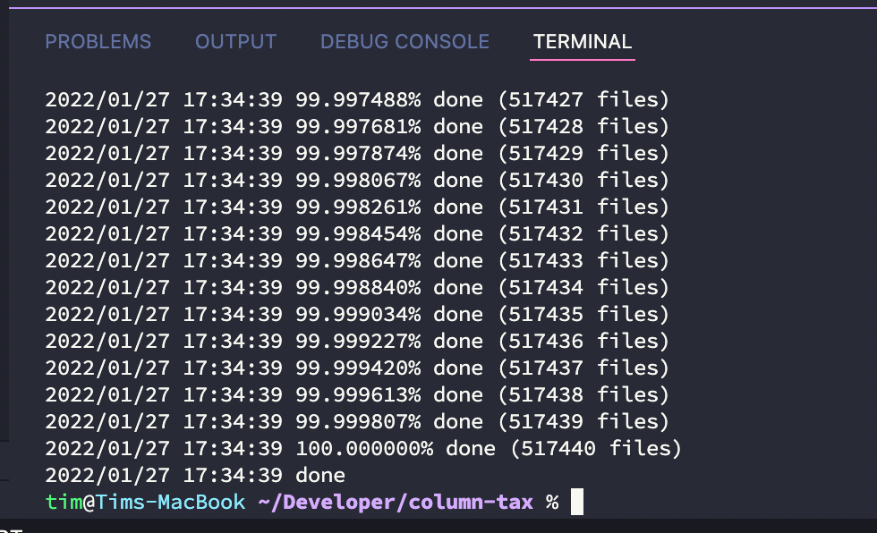
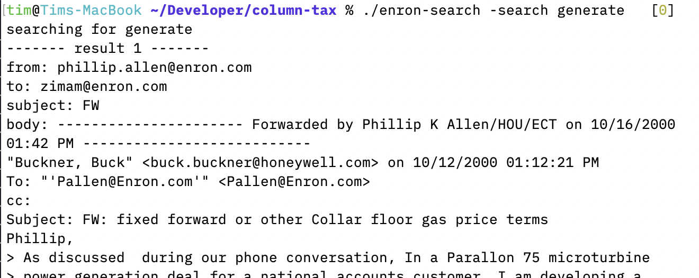
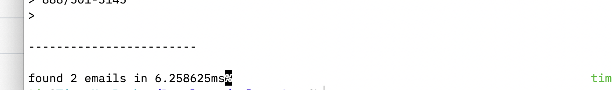
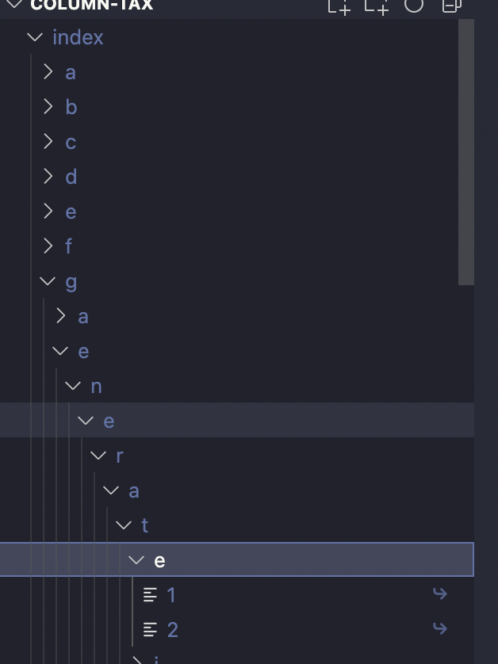

I committed a binary (`./enron-search`) which should work on M1 Mac.

To build for other machines:
First, install go (I used 1.17, but it probably works on 1.18 too and maybe even lower). Then run `./build.sh`. This outputs the binary.

To use:
First, copy the Enron data into a directory in this folder, `raw-data`.
For example, there should be a directory `./raw-data/allen-p`, `./raw-data/arnold-j`, and so on.
I added this data to gitignore because git was very unhappy even trying to commit it. 

To generate the index:
`./enron-search -genindex`
The index is also in gitignore.

You should see output like:

It takes about 10 minutes.

To search the index:
`./enron-search -search apple`

You should see output like:

Strategy:
The index is a Trie-like data structure which lives entirely on disk.

All email files in the corpus are read in by the parser (main.go and email.go). Then, a directory structure is created which is the index.  The index has folders a-z representing one character in a word. Subdirectories are the second character, third character, and so on. When a word ends, a symlink is inserted into the directory tree, which links to the raw email file in the corpus.

This makes for a very fast search and very little memory usage (almost negligible). The search function (search.go) just traverses the directory structure and can output emails immediately.

Note: I added a few restrictions on what is generated in the index (lowercase a-z, all special chars stripped out, numbers stripped out, and only 50 symlinks per search term). The index could be far less restricted, I bet (maybe all of these could be removed), but I didn't have enough time to make sure nothing breaks.
